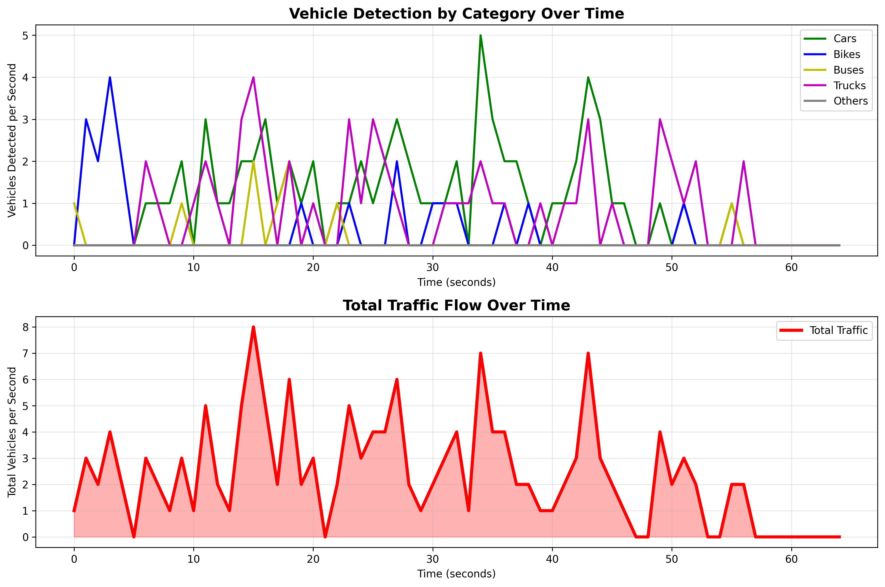
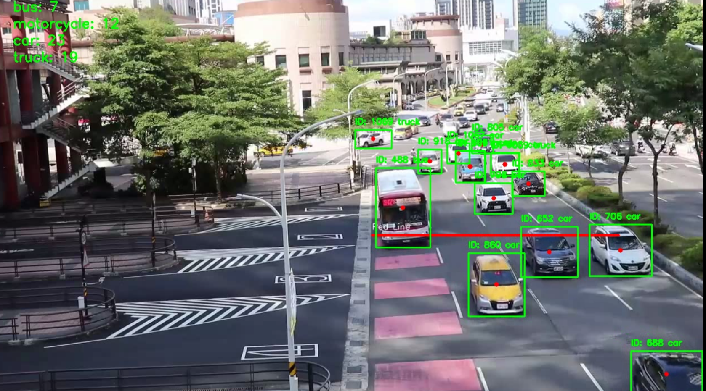

# Professional Vehicle Detection and Counting System 🚗

**A comprehensive traffic analysis solution using YOLOv11 for real-time vehicle detection, counting, and data analytics.**

[](https://python.org)
[](https://ultralytics.com)
[](https://opencv.org)
[](https://streamlit.io)

**YOLOv11 (You Only Look Once)** is a state-of-the-art object detection model known for its speed and accuracy. This professional-grade implementation provides comprehensive vehicle detection, tracking, and analytics capabilities suitable for traffic monitoring, smart city applications, and research purposes.

## 🌟 Key Features

### 🎯 Advanced Detection & Tracking
- **Real-time vehicle detection** using YOLOv11 deep learning model
- **Multi-class vehicle recognition**: Cars, Bikes, Buses, Trucks, Others
- **Intelligent tracking** with unique ID assignment
- **Crossing-line counting** with configurable detection zones

### 📊 Professional Data Analytics
- **Time-series data logging** (vehicles per second)
- **Category-wise traffic analysis** with detailed breakdowns
- **CSV data export** for further analysis
- **Real-time statistics** display during processing

### 📈 Advanced Visualizations
- **Traffic flow charts** showing temporal patterns
- **Category-specific trend analysis**
- **Peak traffic identification**
- **High-resolution plot exports** (PNG format)

### 📝 Comprehensive Reporting
- **Automated text summaries** in plain English
- **Statistical insights** and traffic density analysis
- **Professional analysis reports**
- **Performance metrics** and recommendations

### 🌐 Modern Web Interface
- **Streamlit web application** for easy operation
- **Drag-and-drop video upload**
- **Real-time progress tracking**
- **Interactive results dashboard**

## 🛠️ Technology Stack

- **🧠 AI/ML**: YOLOv11 (Ultralytics), PyTorch
- **👁️ Computer Vision**: OpenCV
- **📊 Data Science**: Pandas, NumPy, Matplotlib
- **🌐 Web Framework**: Streamlit
- **🐍 Language**: Python 3.8+

---

## 🛠️ Installation & Setup

### 1️⃣ Prerequisites

Ensure you have **Python 3.8+** installed on your system.

### 2️⃣ Clone Repository

```bash
git clone <repository-url>
cd Vehicle-Detection-and-Counter
```

### 3️⃣ Quick Setup (Recommended)

Run the automated setup script:

```bash
python setup.py
```

### 4️⃣ Test Installation

Verify everything is working:

```bash
python test_installation.py
```

### 5️⃣ Install Dependencies Manually (Alternative)

```bash
pip install -r requirements.txt
```

### 6️⃣ Download YOLO Model

Download the **YOLOv11 weights** file (`yolo11l.pt`) from the [official Ultralytics repository](https://docs.ultralytics.com/models/yolo11/#performance-metrics). Place it in the project root directory.

### 7️⃣ Prepare Test Video

Create a `test videos` folder and place your traffic video as `test video_1.mp4`, or update the path in the code.

## 🚀 Usage

### 🖥️ Command Line Interface

```bash
python main.py
```

### 🌐 Web Interface (Recommended)

```bash
streamlit run streamlit_app.py
```

Then open your browser to `http://localhost:8501`

## 📊 Output Files

All results are saved in the `outputs/` folder:

| File | Description |
|------|-------------|
| `processed_video.mp4` | Video with detection overlays |
| `traffic_data.csv` | Time-series vehicle count data |
| `traffic_plot.png` | Traffic flow visualization |
| `analysis_summary.txt` | Comprehensive text report |

### Sample CSV Data Structure

```csv
time_in_seconds,cars,bikes,buses,trucks,others,total
0,2,1,0,1,0,4
1,3,0,1,0,0,4
2,1,2,0,2,0,5
...
```

### 🔧 Common Issues and Solutions

**Issue: `'buss'` KeyError**
- **Problem**: Incorrect pluralization of vehicle categories
- **Solution**: Fixed category pluralization mapping
- **Details**: The system now properly converts 'bus' → 'buses' instead of 'bus' → 'buss'

## 🎯 Customization Options

### 📊 Detection Parameters

```python
# Initialize with custom settings
detector = VehicleDetectionSystem(
    model_path='yolo11l.pt',    # Model variant
    line_position=430           # Counting line Y-coordinate
)
```

### 🚗 Vehicle Categories

Modify the `vehicle_categories` dictionary in `main.py`:

```python
vehicle_categories = {
    'car': [2],           # COCO class: Car
    'bike': [1, 3],       # COCO classes: Bicycle, Motorcycle  
    'bus': [5],           # COCO class: Bus
    'truck': [7],         # COCO class: Truck
    'others': [6]         # COCO class: Train and others
}
```

### 🎨 Visualization Colors

Customize detection colors in the `_get_category_color()` method.

## 📊 Sample Analysis Output

### 📈 Traffic Flow Chart


### 📋 Text Summary Example
```
=== VEHICLE DETECTION ANALYSIS SUMMARY ===
📊 OVERALL STATISTICS:
• Analysis Duration: 2.1 minutes
• Total Vehicles Detected: 157
• Average Traffic Rate: 74.8 vehicles/minute

🚗 VEHICLE BREAKDOWN:
• Cars: 98 (62.4%)
• Bikes: 23 (14.6%)
• Buses: 8 (5.1%)
• Trucks: 21 (13.4%)
• Others: 7 (4.5%)

⚡ TRAFFIC INSIGHTS:
• Peak Activity: 12 vehicles detected at 47 seconds
• Most Common Vehicle: car
• Traffic Density: High
```

## 🚀 Advanced Features

### 👨‍💼 Professional Development Ready
- **Modular code structure** with clean separation of concerns
- **Object-oriented design** following best practices
- **Comprehensive error handling** and logging
- **Type hints and documentation** for maintainability

### 📈 Data Science Integration
- **Pandas DataFrames** for structured data analysis
- **Matplotlib visualizations** with professional styling
- **Statistical analysis** and trend identification
- **Export capabilities** for integration with other tools

### 🌐 Deployment Ready
- **Streamlit web interface** for easy deployment
- **Containerization ready** (Docker compatible)
- **Cloud deployment** compatible (AWS, GCP, Azure)
- **API endpoints** ready for integration

## 📋 Project Structure

```
Vehicle-Detection-and-Counter/
├── main.py                    # Core detection system
├── streamlit_app.py          # Web interface
├── requirements.txt          # Dependencies
├── README.md                 # Documentation
├── LICENSE                   # MIT License
├── yolo11l.pt               # YOLO model weights
├── test videos/
│   └── test video_1.mp4      # Input video
└── outputs/
    ├── processed_video.mp4   # Output video
    ├── traffic_data.csv      # Analysis data
    ├── traffic_plot.png      # Visualization
    └── analysis_summary.txt  # Report
```

## 🔬 API Reference

### VehicleDetectionSystem Class

```python
class VehicleDetectionSystem:
    def __init__(self, model_path='yolo11l.pt', line_position=430)
    def detect_and_count(self, video_path, output_folder='outputs')
    def save_results(self, counts_df, category_counts, output_folder='outputs')
    def categorize_vehicle(self, class_name)
```

### Key Methods

- **`detect_and_count()`**: Main detection and counting function
- **`save_results()`**: Export analysis results to files
- **`categorize_vehicle()`**: Map YOLO classes to vehicle categories

## 🎨 Future Enhancements

- 📹 **Real-time webcam support**
- ⚡ **Speed estimation** for detected vehicles
- 🗺️ **Multi-lane detection** with separate counting
- 🔄 **Real-time streaming** to cloud platforms
- 🤖 **AI-powered insights** and anomaly detection
- 📱 **Mobile app integration**

## 🤝 Contributing

Feel free to fork the repository, improve the project, and create a pull request!

## 📜 License

This project is licensed under the [MIT License](https://opensource.org/licenses/MIT).

## 📷 Preview



## 📧 Contact

For any queries, reach out to me at **sruja2401@gmail.com**.

---

⚡ **Happy Coding!** 🚗🚦

# Traffic

